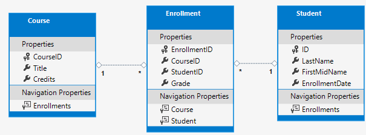

# Startup a project with EF Core
 To get started a new project wich depends upon Entity Framework there are some preliminar steps to follow.
 First of all, we have to install all these following packages, paying attention of the  database you want to use.

## Index
 - [Initial project configuration](#Initial-project-configuration)
 - [Scaffolding existing database](#Scaffolding-existing-database)
 - [Initial project configuration](#Initial-project-configuration)
 - [Scaffolding existing database (Database First)](#Scaffolding-existing-database-(Database-First))
    - [Scaffold from cli](#Scaffold-from-cli)
    - [Pluralize the properties in the new DbContext](#Pluralize-the-properties-in-the-new-DbContext)
    - [Istantiate the DbContext](#Istantiate-the-DbContext)
 - [Create from the scratch (Code First)](#Create-from-the-scratch-(Code-First))

 ## Prerequisites
  - Visual studio code
  - This project uses the Sakila database, available from mysql site used for demo purpose. If you want to follow this guide step-by-step, you can download Sakila db from [here](./SakilaDB/sakila-db.zip).
 ## Initial project configuration

  `dotnet add package` - is the command that adds a package reference to a project file.

  - `dotnet add package Microsoft.EntityFrameworkCore`
  - `dotnet add package Microsoft.EntityFrameworkCore.Design`
  - `dotnet add package Microsoft.EntityFrameworkCore.Tools`
  - `dotnet add package Microsoft.EntityFrameworkCore.Tools.DotNet`
  - `dotnet add package Pomelo.EntityFrameworkCore.MySql`
  - `dotnet add package Pomelo.EntityFrameworkCore.MySql.Design`

  **Note:** Remember to change in your `*Project.csproj` these lines

  ```xml
    <PackageReference Include="Microsoft.EntityFrameworkCore.Tools" Version="2.0.1" />
    <PackageReference Include="Microsoft.EntityFrameworkCore.Tools.DotNet" Version="2.0.1" />
  ```

  in:

  ```xml
    <DotNetCliToolReference Include="Microsoft.EntityFrameworkCore.Tools" Version="2.0.1" />
    <DotNetCliToolReference Include="Microsoft.EntityFrameworkCore.Tools.DotNet" Version="2.0.1" />
  ```
 ## Scaffolding existing database (Database First)


  ### Scaffold from cli
  In order to scaffold (wich means: get my database structure and convert it into some classes in my project), you have to launch this command:

  ```ps
  dotnet ef dbcontext scaffold "server=192.168.42.128;userid=root;pwd=d0808!;port=3306;database=sakila" Pomelo.EntityFrameworkCore.MySql -o Entites
  ```

  Analyzing this command we could say:

  ```ps
  dotnet ef dbcontext scaffold "<MY DATABASE CONNECTION STRING>" <THE PROVIDER> <-o WHERE TO PLACE THE OUTPUT> <MY FOLDER>
  ```
  ### Pluralize the properties in the new DbContext
   The classes generated from the migration now appears like this:

   ```cs
   public partial class sakilaContext : DbContext
    {
        public virtual DbSet<Actor> Actor { get; set; }
        public virtual DbSet<Address> Address { get; set; }
        public virtual DbSet<Category> Category { get; set; }
    // Hidden for brevity
   ```
   In order to pluralize in all project these property without generate any errors, rename them selecting the property and pressing <kbd>F2</kbd>.
   
   Then the expected class should appear like: 
   ```cs
   public partial class sakilaContext : DbContext
    {
        public virtual DbSet<Actor> Actors { get; set; }
        public virtual DbSet<Address> Addressess { get; set; }
        public virtual DbSet<Category> Categories { get; set; }
    // Hidden for brevity
   ```
  ### Istantiate the DbContext
   To initialize our database wich we'll use in our application, is sufficient to instantiate the class generated by the scaffolding. The name of the class we will use is the one wich contains the `*Context.cs"` suffix. Then do as follow:

   ```cs
        // Program.cs
        static void Main(string[] args)
        {
            var context = new sakilaContext();
            var movies = context.Films;
            
            foreach (var movie in movies)
            {
                Console.WriteLine($"- {movie.Title}");
            }

            Console.WriteLine($"{movies.Count()} found.");
        }
   ```
   At this point, we can operate on the database very easly without worry about how about our application is communicating with the database. 
 ## Create from the scratch (Code First)
  We want to create this structure in our database from our code.
  

  We can imagine these tables as classes, as is follow: 
  ```cs
  // The Student Entity Class
  ///////////////////////////
  public class Student
  {
    public int ID { get; set; }  //this is the primary key of the Student table
    public string LastName { get; set; }
    public string FirstMidName { get; set; }
    public DateTime EnrollmentDate { get; set; }

   //Enrollments is a navigation property to gold enrollment data found in an other table
    public ICollection<Enrollment> Enrollments { get; set; }
  }
  ```
  The `ID` property rapresents the primary key of the class wich will reflects in the table.

  >**Note:** in some example you will find in the internet you will notice that someone it used to write `classnameID`. It's a best practice to leave the `ID` property as `ID` without any class name, in order to have a good inheritance implementation.
  
  The collections in the classes are named *Navigation property*.

  As you will notice, there is an attribute on top of the class `Course` named `[DatabaseGenerated(DatabaseGeneratedOption.None)]`. This attribute lets you to enter the primary key if isn't generated.

  ### Creating the model
   After create the `SchoolContext`, it's time to create the mappers.
  
   ```cs
   protected override void OnModelCreating(ModelBuilder modelBuilder)
   {
        modelBuilder.Entity<Course>().ToTable("Course");
        modelBuilder.Entity<Enrollment>().ToTable("Enrollment");
        modelBuilder.Entity<Student>().ToTable("Student");
   }
   ```

   There are 2 methods of creating the model with model builder:
   - Fluent Api: wich is the best, because it permits you to configure your table without modify your entity classes;

   ```cs
    //example of Fluent API
    class MyContext : DbContext
    {
        public DbSet<Blog> Blogs { get; set; }

        protected override void OnModelCreating(ModelBuilder modelBuilder)
        {
            modelBuilder.Entity<Blog>()
                .Property(b => b.Url)
                .IsRequired();
        }
    }
   ```
   - Data annotations: wich modify your entities but should be overwritten by Fluent Api modifications. 

   ```cs
    public class Blog
    {
        public int BlogId { get; set; }
        [Required]
        public string Url { get; set; }
    }
   ```

   See the example: https://youtu.be/vLwAfE2Q6wI